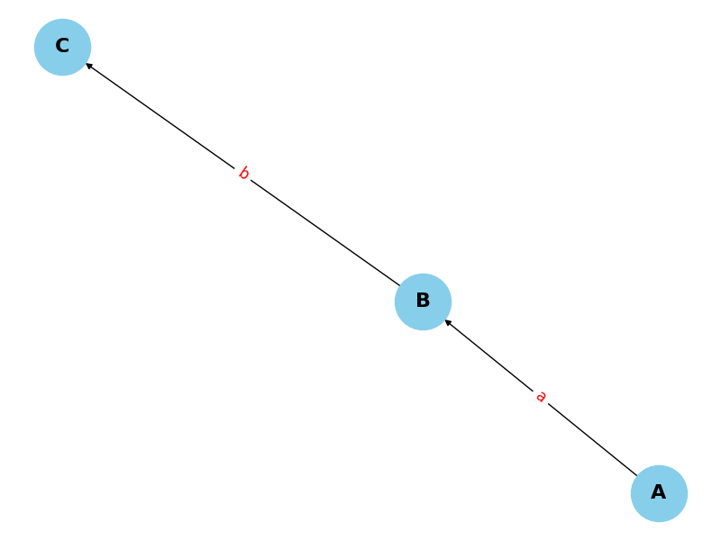

# Single-Source CFL Reachability Problem

## Overview

This project addresses the **Single-Source CFL Reachability Problem**. In this context, we are given:
- An edge-labeled graph \( G \)
- A context-free grammar \( G_m \)
- A designated source vertex \( s \)

The objective is to determine all vertices \( t \) that are *CFL-reachable* from \( s \).

## Problem Description

A vertex \( t \) is considered **CFL-reachable** from \( s \) if and only if there exists at least one path from \( s \) to \( t \) such that the concatenation of labels along this path forms a string belonging to the language defined by \( G_m \).
